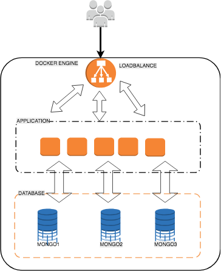

#Exemplo de stack devops - Simple Form

##Dependências do Projeto

- Docker Engine release 17.04.0+
- Docker Compose 1.10.0+

##Para Iniciar o Projeto

A partir do diretório do projeto, executar:

```
docker-compose -f docker-compose.yml up -d --build
```

###Administrando a stack

Scale da aplicação:

```
docker-compose -f docker-compose.yml scale application=10
```

##URLs do Projeto

- Form Sugestões: http://<IP-HOST-DOCKER>
- Backend info: http://<IP-HOST-DOCKER>/api/v1/info
- Backend lista sugestões: http://<IP-HOST-DOCKER>/api/v1/sugestoes
- Zabbix: http://<IP-HOST-DOCKER>:8080

##Credenciais de Acesso

- Zabbix => Usuário: Admin / Senha: zabbix
- Mongo: sem autenticação


##Fluxo de Acesso da aplicação 



##Detalhes Técnicos do Projeto

###Database

Cluster MongoDB composto por 3 containers em um cluster baseado em replicaset e 1 container ephemeral para deploy do cluster.

Seguindo a descrição do docker-compose, tem-se:

- Nós do cluster: mongo1, mongo2 e mongo2
- mongo-setup: Conteiner utilizado para realizar o deploy do cluster executando o setup.sh no startup


###Application

A aplicação foi construída utilizando a linguagem python e o microframework flask.

Foi adotado no desenvolvimento o padrão arquitetural MVC. 

A aplicação trabalha recebendo os verbos HTTP GET e POST, para a leitura e cadastro das sugestões respectivamente.

O deploy da aplicação foi feito utilizando o WSGI python uWSGI escutando na porta 9090.


###Loadbalance

O loadbalance foi construido utilizando o servidor WEB NGINX.

Foi configurado um upstream apontando para o DNS do cluster que realiza o Round-robin entre os containers da aplicação,
permitindo  realizar o "scale up" e/ou "scale down" da aplicação.

O servidor também é responsável por entregar a "SPA" com o form de cadastro das sugestões. O form realiza chamada POST à
aplicação para realizar o cadastro, onde não é possível cadastrar duas sugestões com o mesmo e-mail.


###Zabbix

Foi utilizado a imagem disponível no repositório oficial do zabbix para subir o servidor.

A configuração para descoberta automática e inserção do template de monitoramento do backend, é realizado pelo container 
setup-zabbix. O mesmo executa o script setup.py, que faz uso da API do Zabbix para manipulação dessas configurações no 
startup.


